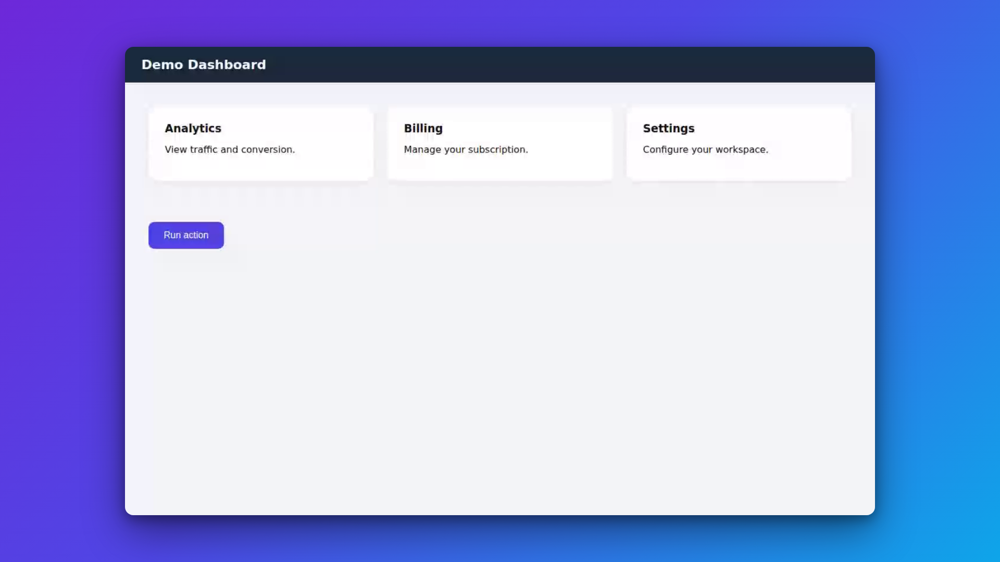
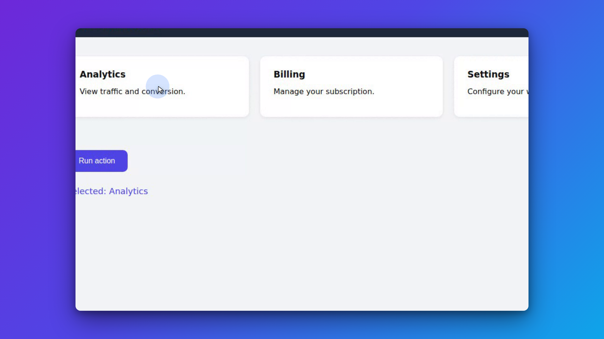

# Screen Studio skill

A [Claude Code](https://claude.com/claude-code) **skill** that records a web browser
for a chosen duration and automatically edits it into a polished, *Screen Studio*-style
video — smooth **auto zoom-on-click**, a **synthetic glide cursor**, and a cinematic
frame (gradient background, rounded corners, drop shadow).

| Idle frame | Zoom-on-click |
| --- | --- |
|  |  |

## Why this stack

| Stage | Tool | Why |
| --- | --- | --- |
| Capture | **Playwright** (headful/headless Chromium) | `recordVideo` produces a **cursor-free** page video (ideal for a synthetic cursor) and an injected listener logs **pixel-perfect** click/move coordinates. No OS-level global hooks. |
| Transcode | **ffmpeg** (`ffmpeg-static`) | Playwright outputs VP8 `.webm`; ffmpeg makes a constant-fps H.264 `.mp4` for reliable seeking. |
| Edit / render | **Remotion** (React) | `spring()`/`interpolate()` give cinematic zoom-pan easing, plus the synthetic cursor, click ripple, and framing — far beyond ffmpeg `zoompan`. |

### What about steel.dev?

Evaluated and **not used**. [steel.dev](https://steel.dev) records *cloud* headless-browser
sessions (rrweb / WebRTC of a browser in their infra), not your real local browser. Its
value is managed anti-bot/proxy infrastructure for *scaled agent automation*. For a
personal demo recorder, local Playwright captures your actual browser at full fidelity
with zero cloud cost. steel would only win for fully-cloud automated recording at scale.

## How it works

```
record.mjs (Playwright)                 build.mjs                  Remotion <ScreenStudio>
 ├─ headful/headless Chromium     ─►  ├─ ffmpeg webm→mp4     ─►   ├─ <OffthreadVideo> zoomed toward
 ├─ recordVideo (cursor-free)         └─ remotion render          │    each click (spring ease)
 ├─ injected click/move listener                                  ├─ synthetic smoothed cursor + ripple
 └─ recording.webm + events.json                                  └─ gradient bg, radius, shadow
```

`events.json` carries the capture size and a timestamped event log:

```json
{ "fps": 30, "width": 1280, "height": 800,
  "contentWidth": 1280, "contentHeight": 800, "durationMs": 30000,
  "events": [ { "t": 1500, "type": "click", "x": 640, "y": 400 } ] }
```

## Setup

```bash
npm install
npx playwright install chromium
```

ffmpeg ships via `ffmpeg-static`. The scripts **auto-detect** their browser and ffmpeg, so
no env vars are normally needed: locally they use Playwright's/Remotion's own bundled
Chromium; in a cloud sandbox they pick up a preinstalled browser, and if no H.264-capable
ffmpeg is available they automatically feed the capture to Remotion as-is. Overrides exist if
you want them (`SS_CHROMIUM_PATH`, `FFMPEG_PATH`, `--no-transcode`).

## Where to run it

| Surface | Runs on | Live mode (you click) | Script mode (Claude drives) | Output |
| --- | --- | --- | --- | --- |
| **Local CLI / desktop app** | your PC | ✅ | ✅ | `out/final.mp4` |
| **Remote Control** (`claude --remote-control "Rec"` or `/rc`) | your PC, controlled from phone | ✅ *(while you're at the PC)* | ✅ kick off from phone | `out/final.mp4` on the PC |
| **Claude Code on the web** | cloud container | ❌ no screen | ✅ headless | sent to you in-session |

Notes: a cloud Claude **cannot see your local screen** — it records its own browser. For
the web path, choose an environment with an **internet-enabled network policy** so the target
URLs are reachable. Retrieve the local output any time with `npm run open-out`.

## Usage

### Live mode (you click)
```bash
node scripts/record.mjs --mode live --url https://app.example.com --duration 30
node scripts/build.mjs   # -> out/final.mp4
```
A real browser opens; interact for the duration, then it auto-stops and renders.

### Script mode (automated)
```bash
node scripts/record.mjs --mode script --url https://app.example.com --steps examples/demo-steps.json --duration 20
node scripts/build.mjs
```
Steps are a JSON array of `goto` / `click` / `type` / `press` / `hover` / `scroll` / `wait`
actions; the cursor glides between targets automatically. See `examples/demo-steps.json`.

### Preview / tweak interactively
```bash
npm run studio   # opens Remotion Studio on the last build's events.json
```

## Key flags

**record.mjs:** `--mode live|script` · `--url` · `--duration <s>` · `--steps <file>` ·
`--out <dir>` · `--size 1280x800` · `--fps 30` · `--headed`/`--headless`

**build.mjs:** `--in <dir>` · `--out <file.mp4>` · `--no-transcode` ·
env `FFMPEG_PATH` · env `SS_CHROMIUM_PATH` (override the auto-detected browser)

**Other scripts:** `npm run open-out` (print/open the newest `out/*.mp4`) ·
`npm run setup` (install deps; safe no-op if already installed).

### Optional: auto-install on cloud sessions
To make a fresh Claude Code **web** session install deps automatically, add a `SessionStart`
hook to `.claude/settings.json`:
```json
{ "hooks": { "SessionStart": [ { "hooks": [ { "type": "command", "command": "node scripts/setup.mjs" } ] } ] } }
```
(Left out of the repo by default since it auto-runs a command — opt in if you want it.)

## Customizing the look

- **Zoom** amount/timing: `remotion/src/zoom.ts` (`ZOOM_SCALE`, cluster gap, easings)
- **Frame** (gradient, padding, radius, shadow): `remotion/src/ScreenStudio.tsx`
- **Cursor** smoothing/size + click ripple: `remotion/src/Cursor.tsx`, `remotion/src/cursor.ts`

## Notes & limitations

- Records a **browser**, not the whole desktop. Desktop capture would swap the capture
  stage for ffmpeg `gdigrab` (Windows) / `avfoundation` (macOS) / `x11grab` (Linux),
  losing cursor-free capture and exact click coordinates.
- The output cursor is **synthetic** — Playwright's capture has no OS cursor, so the
  smoothed cursor is rendered from the move log.
- Headless capture forces `--window-size` to the capture size so the recorded frame
  isn't padded; live mode runs headful so you can interact.
