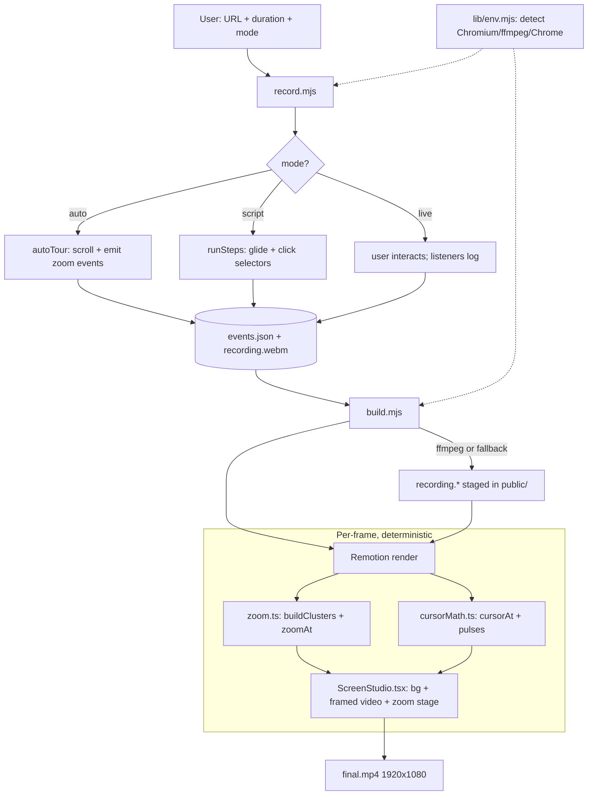

# Architecture

How the Screen Studio skill turns a browser session into a polished, zoom-on-click video.

## Big idea: 3 decoupled stages + 1 contract

```
CAPTURE  ──►  events.json + recording.webm  ──►  TRANSCODE  ──►  EDIT / RENDER  ──►  final.mp4
(Playwright)         (the contract)                (ffmpeg)         (Remotion)
```

The key design decision: **the recorded video contains no cursor.** Playwright's
`recordVideo` captures only the page, not the OS pointer. Everything visual — the smoothed
cursor, the zooms, the framing — is *reconstructed afterward* from a timestamped event log
(`events.json`). That separation is what keeps the system clean, testable, and deterministic.

## Component map

| File | Stage | Role |
| --- | --- | --- |
| `scripts/record.mjs` | Capture | Drives Playwright; produces `recording.webm` + `events.json` |
| `scripts/lib/env.mjs` | Capture / Render | Auto-detects Chromium / ffmpeg / render-Chrome so it runs anywhere |
| `scripts/build.mjs` | Transcode + Render | ffmpeg webm→mp4 (or fallback), then invokes Remotion |
| `remotion/src/types.ts` | Contract | `RecEvent` + `Manifest` types (the `events.json` shape) |
| `remotion/src/Root.tsx` | Render | Registers the composition; derives duration from the manifest |
| `remotion/src/ScreenStudio.tsx` | Render | The frame: background, framed video, zoom stage |
| `remotion/src/zoom.ts` | Render | Events → zoom keyframes (`buildClusters`, `zoomAt`) |
| `remotion/src/cursorMath.ts` | Render | Pure math: smoothed cursor position + click pulses |
| `remotion/src/Cursor.tsx` | Render | Draws the synthetic cursor + click ripple |

## The contract: `events.json`

```json
{ "fps": 30, "width": 1280, "height": 800,
  "contentWidth": 1280, "contentHeight": 800, "durationMs": 30000,
  "video": "recording.webm",
  "events": [
    { "t": 1500, "type": "click", "x": 640, "y": 400 },
    { "t": 3000, "type": "zoom",  "x": 900, "y": 220 }
  ] }
```

`t` is milliseconds from recording start. Event types (`remotion/src/types.ts`):
`move`, `click`, `scroll`, `start`, and `zoom` — a **cursor-free** zoom driver used by
auto-tour (zooms without drawing a pointer or ripple).

## Step-by-step data flow

**Capture — `scripts/record.mjs`**
1. Parse args; decide `headless` (live = headful, auto/script = headless) — `record.mjs:44`.
2. Guard: live mode on a screenless host exits early with guidance — `record.mjs:48`.
3. Launch Chromium (auto-detected path) with `--window-size` matching capture size so the
   video fills the frame — `record.mjs:234`.
4. Open a context with `recordVideo` on, a fixed viewport, a `__recordEvent` binding
   (page → Node), and an init script that hooks `mousemove`/`mousedown`/`scroll` on **every**
   document — `record.mjs:62, 248`.
5. `startTime = Date.now()` is the recording clock origin; each event is stamped
   `t = Date.now() - startTime` on the Node side — `record.mjs:250, 255`.
6. Run the chosen mode:
   - **auto** → `autoTour()` finds prominent elements, `smoothScrollTo` each, emits a
     cursor-free `zoom` event at the element's viewport centre — `record.mjs:173`.
   - **script** → `runSteps()` `glide`s the mouse to selectors; the real `mousemove`/`click`
     events are logged by the init-script listeners — `record.mjs:114`.
   - **live** → waits while the user interacts; listeners log everything.
7. Read the *actually painted* viewport (`innerWidth/Height`) to handle Playwright's
   grey-pad quirk — `record.mjs:284`.
8. Close the context (flushes the `.webm`); write `events.json` — `record.mjs:299`.

**Transcode + Render — `scripts/build.mjs`**
9. Find `recording.{webm,mp4,mkv}`. If a H.264-capable ffmpeg exists, transcode to mp4;
   otherwise **fall back** to feeding the source straight to Remotion.
10. Stage the video + manifest into `remotion/public/`.
11. `npx remotion render ScreenStudio` with the manifest as props (auto-detecting a render
    Chrome when needed).

**Inside Remotion (per frame, deterministic)**
12. `Root.tsx` sets `durationInFrames = ceil(durationMs / 1000 * fps)`.
13. `ScreenStudio.tsx` computes `tMs` for the frame, calls `zoomAt()` for `{scale, origin}`,
    fits the painted content into a padded/rounded/shadowed box, and renders
    `<OffthreadVideo>` + `<Cursor>` inside a "zoom stage" that `scale()`s around the focus.
14. `<Cursor>` uses `cursorAt(tMs)` (smoothed position) + `clickPulses()` to draw the
    synthetic pointer and ripples, counter-scaled by `1/zoom` to stay a constant size.

## The clever bits

- **Zoom math** (`zoom.ts`): clicks/zoom-events within 1.5 s are grouped into a **cluster**
  with an averaged focus point. Each cluster gets a timeline — ease-in (400 ms) → hold
  (until 900 ms after the last event) → ease-out (650 ms). `zoomAt` is a **pure function of
  time** returning a scale and a CSS `transform-origin` percentage. Because the zoom uses
  `transform-origin`, it scales *around* the focus point and never reveals empty edges.
- **Cursor smoothing** (`cursorMath.ts`): `cursorAt` is a trailing weighted average over a
  140 ms window of the interpolated raw path — the "glide." Also pure/deterministic.
- **Content-region clipping** (`ScreenStudio.tsx:38`): Playwright can pad the video bottom
  with grey; the recorder stores the real painted size, and the composition scales the video
  so only that region fills the rounded box (the grey overflows and is clipped).
- **`zoom` vs `click`**: `buildClusters` treats both as zoom drivers, but `Cursor.tsx` only
  draws the cursor/ripple for `move`/`click`. That's what lets **auto-tour zoom with no
  cursor**.

## Component flow



## Pros

- **Clean separation** via one JSON contract — each stage is independently testable/swappable.
- **Cursor-free capture + synthetic overlay** enables the polished look and the cursor-free
  auto-tour.
- **Deterministic rendering** (`zoomAt`/`cursorAt` are pure functions of time) → reproducible
  output, live-previewable in Remotion Studio (`npm run studio`).
- **Runs anywhere** — `env.mjs` auto-detection + fallbacks make it turnkey on local, Remote
  Control, and cloud with no env vars.
- **Generic** — three modes cover any-site (auto), interactive (live), precise flows (script);
  nothing is hardcoded to a demo.
- **Resilient** — per-step `try/catch`, ffmpeg/transcode fallbacks, headless-live guard.

## Cons / limitations

- **A/V sync is approximate** — events are stamped on the Node side at binding time, not
  calibrated to the video's first real frame; a small drift (tens of ms) is possible.
- **Zoom focus switches discretely between clusters** — `zoomAt` activates one cluster at a
  time; it doesn't *pan* smoothly between two nearby focus points.
- **Auto-tour heuristics are simple** — can pick an odd element or zoom a cookie/consent
  banner; no consent dismissal or importance ranking beyond size/position.
- **Cursor lag** — the 140 ms smoothing window means the synthetic cursor trails the true
  position slightly; the ripple sits at the exact click point.
- **Fixed landscape 1920×1080, no audio, no webcam/captions** — portrait/mobile captures
  letterbox heavily.
- **Browser-only** — no desktop/window capture (by design).
- **Render is heavy** — Remotion renders frame-by-frame via headless Chrome; long videos are
  slow.
